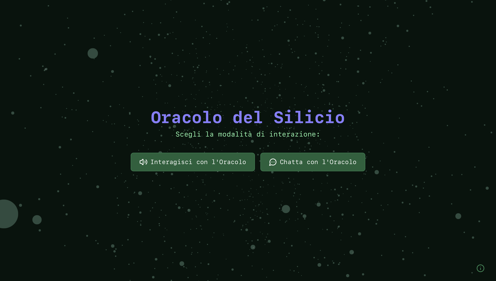

# 🧠 Silicon Oracle


[🇮🇹 Versione italiana](./README.md)

---

## 🖼️ Preview



> _Insert a screenshot or animated GIF of the project in the `app/` folder._

---

_“The digital consciousness of Turin, year 3000.”_

## 🌐 About

**Silicon Oracle** is an interactive web application developed as an artistic thesis project for the BA in New Technologies of Art at the Academy of Fine Arts, Turin.

Set in a **sci-fi vision of Turin in the year 3000**, the project simulates a contemporary oracle: an invisible AI that communicates through a synthetic voice and a cloud of animated 3D particles — blending future technology with ancient ritual.

This creation is grounded in the theoretical context of the thesis _“Reprogrammed Anatomies: Biological and Technological Transformations in the Urban Future of Turin”_, translating themes such as **posthumanism**, **eco-horror**, and **unstable coexistence** into an immersive and contemplative digital experience.

The Oracle is not a typical chatbot — it acts as a liminal device, a meditative entity that invites existential reflections within radically transformed urban landscapes.

## 🧩 Features

- **Oracle Mode (TTS)**: voice interaction using real-time speech synthesis (via ElevenLabs), visually animated through React Three Fiber.
- **Text Chat Mode**: fast GPT-4o-based messaging interface with contextualized sci-fi dialogue.
- **Narrative Depth**: each response integrates environmental, philosophical, and speculative elements.
- **Custom Dataset (JSON)**: the `manuale.json` file defines personality rules, tone, and knowledge base, serving also as input for the RAG system.

## 🚀 Tech Stack

| Technology                  | Role in the Project                                                                |
|-----------------------------|-------------------------------------------------------------------------------------|
| **Next.js**                 | App Router, serverless APIs, hybrid rendering between client and server             |
| **React Three Fiber / Drei**| 3D rendering of particle-based animations, dynamic visual scenes                    |
| **Tailwind CSS**            | Atomic and responsive styling, visual coherence across modes                        |
| **OpenAI GPT‑4o**           | Multimodal conversational generation (input, response, and RAG context)             |
| **ElevenLabs TTS**          | Real-time voice synthesis, low-latency, high-quality Italian vocal output           |
| **RAG Service**             | Semantic retrieval from `manuale.json` using embedding and similarity matching      |

## 🧠 Project Architecture

**/app**

  api/

    chat/

      route.ts # Chatbot API (OpenAI GPT‑4o + RAG)

    tts/

      route.ts # Text-to-speech API (ElevenLabs)

  components/

    Chatbot.tsx # Chat interface: state management + TTS

    VisualEntityWrapper.tsx # 3D Oracle animation (particle cloud)

  chat/

    page.tsx # Main page (text chat)

  tts/

    page.tsx # Oracle mode page (voice only)

  page.tsx # Landing page: interaction mode selection

The project follows a clear separation of concerns to ensure modularity, security, and scalability: AI and TTS logic run server-side, while the client focuses solely on presentation and interaction.

## 🎨 User Experience (UX)

- **Oracle Mode**: the particle cloud visually reflects Idle, Processing, and Speaking states, synchronized with audio for immersive emotional feedback.
- **Chat Mode**: minimalist dark-mode UI, local history storage via `localStorage`, status indicators, and auto-formatted input.
- **Responsive Design**: adaptive 3D canvas, dynamic FoV scaling, and fluid layout across mobile and desktop.
- **Visual Palette**: dark backgrounds (#081910, #0B2014), white text, and accent colors (#887FFF, #8CFFB1, #2E8B57) for buttons and indicators.
- **Ritualized Experience**: temporary input lock during Oracle mode encourages mindful interaction and reflective pacing.

## 🧑‍🎓 Author

**Federica Gaglianone**  
Bachelor’s Degree in New Technologies of Art  
Academy of Fine Arts, Turin (Italy)  
> “A project born from the fusion of theoretical research, artistic vision, and technological experimentation.”

## 📜 License

Released under the **MIT License**. See the `LICENSE` file for details.

## ▶️ Run Locally

This is a [Next.js](https://nextjs.org) project bootstrapped with [`create-next-app`](https://nextjs.org/docs/app/api-reference/cli/create-next-app).

### Getting Started

Run the development server:

```bash
npm run dev
# or
yarn dev
# or
pnpm dev
# or
bun dev
```

Open [http://localhost:3000](http://localhost:3000) with your browser to see the result.

You can start editing the page by modifying app/page.tsx. The page auto-updates as you edit the file.

This project uses [next/font](https://nextjs.org/docs/app/building-your-application/optimizing/fonts) to automatically optimize and load [Geist](https://vercel.com/font), a new font family for Vercel.

## Learn More

To learn more about Next.js, take a look at the following resources:

- [Next.js Documentation](https://nextjs.org/docs) - learn about Next.js features and API.
- [Learn Next.js](https://nextjs.org/learn) - an interactive Next.js tutorial.

You can check out [the Next.js GitHub repository](https://github.com/vercel/next.js) - your feedback and contributions are welcome!

## Deploy on Vercel

The easiest way to deploy your Next.js app is to use the [Vercel Platform](https://vercel.com/new?utm_medium=default-template&filter=next.js&utm_source=create-next-app&utm_campaign=create-next-app-readme) from the creators of Next.js.

Check out our [Next.js deployment documentation](https://nextjs.org/docs/app/building-your-application/deploying) for more details.
